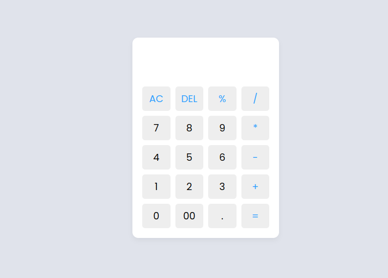

# Calculadora

## Descrição

Este é um projeto simples de uma calculadora criada usando HTML, CSS e JavaScript. A calculadora é capaz de realizar operações básicas como adição, subtração, multiplicação, divisão e calcular porcentagens. O design da calculadora é responsivo, garantindo que ela funcione bem em diferentes tamanhos de tela.

## Funcionalidades

- **Operações Básicas**: Adição, subtração, multiplicação e divisão.
- **Cálculo de Porcentagem**: Permite calcular porcentagens diretamente.
- **Botões de Controle**: Inclui botões para limpar (AC) e deletar o último dígito (DEL).
- **Interface Responsiva**: Layout adaptado para diferentes dispositivos e tamanhos de tela.

## Tecnologias Utilizadas

- **HTML**: Estrutura básica da calculadora.
- **CSS**: Estilização da interface do usuário.
- **JavaScript**: Lógica de cálculo e manipulação da interface.

## Estrutura do Projeto

```
|-- index.html         # Estrutura da página web.
|-- style.css          # Estilos da calculadora.
|-- script.js          # Lógica da calculadora.
|-- README.md          # Documentação do projeto.
|-- LICENSE            # Licença do projeto.
```

## Como Usar

1. Clone este repositório:
   ```bash
   git clone https://github.com/Sr-Christian/Calculadora.git
   ```
2. Navegue até o diretório do projeto:
   ```bash
   cd Calculadora
   ```
3. Abra o arquivo `index.html` no seu navegador preferido.

## Captura de Tela




## Contribuições

Contribuições são bem-vindas! Se você deseja melhorar o projeto ou adicionar novas funcionalidades, sinta-se à vontade para abrir uma issue ou enviar um pull request.

## Licença

Este projeto está licenciado sob a licença MIT - veja o arquivo [LICENSE](LICENSE) para mais detalhes.

## Autor

Desenvolvido por Rodrigo Christian. [Instagram](https://www.instagram.com/christianxz._/)

